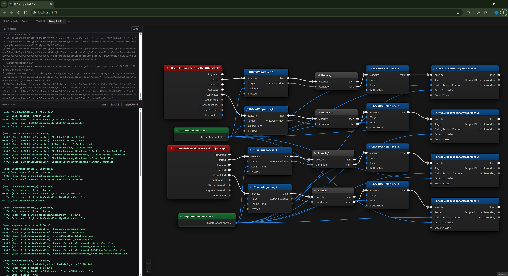
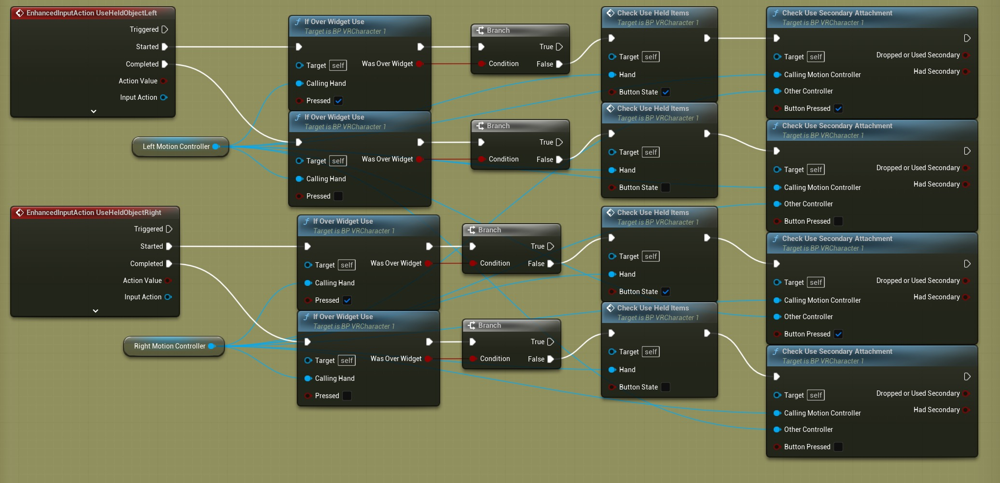

# UE5-Graph-Text-Graph

> A bidirectional Blueprint compiler for Unreal Engine 5.7 — extract, visualize, and AI-generate blueprint logic using a Zero-Token-Tax text format.

**[简体中文](./README.zh.md)**

---





## What is UE5-Graph-Text-Graph?

UE5-Graph-Text-Graph is a developer tool that bridges **Unreal Engine 5 blueprints**, **plain text**, and **visual node graphs** — in both directions.

Instead of the verbose JSON format, UE5-Graph-Text-Graph uses a minimal arrow-based syntax called **GTG-Script**:

```
[Node: Branch] (Macro)
<- IN [Exec: execute]: InputAction_Fire.Started
<- IN [Data: Condition]: Get_Ammo.Value
-> OUT [Exec: True]: FireWeapon.execute
-> OUT [Exec: False]: PlayDryFireSound.execute
```

This format is:

- **Token-efficient** — suitable for pasting directly into AI chat context
- **Human-readable** — understandable without any tooling
- **Renderable** — paste into the app and the canvas renders instantly

---

## Core Workflow

```
UE Blueprint  →  T3D Text  →  GTG-Script  →  AI Context
                                    ↑               ↓
              Canvas render  ←  GTG-Script  ← AI Response
```

1. **Extract**: Copy blueprint nodes in UE5 (Ctrl+C) → Paste into the T3D pane
2. **Convert**: GTG-Script is auto-generated and the visual graph renders immediately
3. **Send to AI**: Copy the `GTG-Script` syntax rules and your GTG-Script, send to any LLM
4. **Receive back**: Paste the AI's GTG-Script response → canvas renders the new blueprint
5. **Multi-tab**: Open multiple tabs to compare different blueprint segments side by side

---

## Interface

The workspace is split into three resizable panes:

| Pane | Content |
|------|---------|
| Top-left | T3D raw blueprint text input (paste from UE, auto-converts) |
| Bottom-left | GTG-Script (auto-generated from T3D, or paste AI output directly) |
| Right | Live visual Blueprint graph canvas |

All three panes are fully resizable by dragging the dividers. Multiple tabs can be opened via the `+` button in the top bar.

---

## GTG-Script Syntax

### Node Declaration

```
[Node: DisplayName] (Type)
```

| Type | Color | Use case |
|------|-------|----------|
| `Event` | Red | CustomEvent, InputAction, BeginPlay |
| `Pure` | Green | Get variable, constant, pure function |
| `Macro` | Gray | Branch, Sequence, ForLoop, Switch |
| `Function` | Blue | Function call, Set variable |

### Pin Declaration

```
<- IN [PinType: PinName]: SourceNode.SourcePin
-> OUT [PinType: PinName]: TargetNode.TargetPin
```

- `PinType`: `Exec` (execution flow) or `Data` (data flow)
- Unconnected values are written inline: `<- IN [Data: Delay]: 0.5`

---

## Build from Source

```bash
git clone https://github.com/jiulengjing/UE5-Graph-Text-Graph
cd UE5-Graph-Text-Graph

# Frontend
npm install
npm run dev     # development
npm run build   # production build

# Desktop binary (Rust/Tauri)
npm run tauri build
```

Requirements: Node.js 20+, Rust stable

---

## Tech Stack

| Layer | Tech |
|-------|------|
| Frontend | React 19, @xyflow/react, Vite |
| Layout engine | dagre (auto-layout for AI-generated graphs) |
| Parser | Custom Two-Pass T3D parser + GTG reverse parser |
| Desktop shell | Tauri 2 + Rust |

---

## License

MIT — free to use, modify, and distribute.
